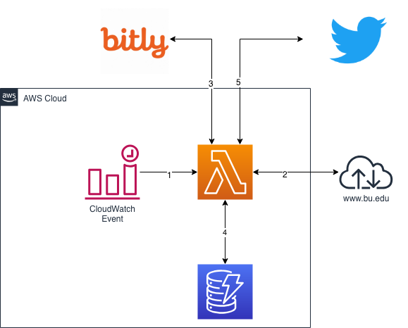

# aws-bu-whatsnew

1. CloudWatch Event triggers the Lambda function on a defined schedule
2. The Lambda function checks the RSS feed that contains the calendar of events
3. Lambda creates a short URL for new events (first checking DynamoDB for events which already have been tweeted)
4. For any new events, stores them into DynamoDB
5. Posts the event to Twitter using a HashTag, the short URL to the event, and the summary